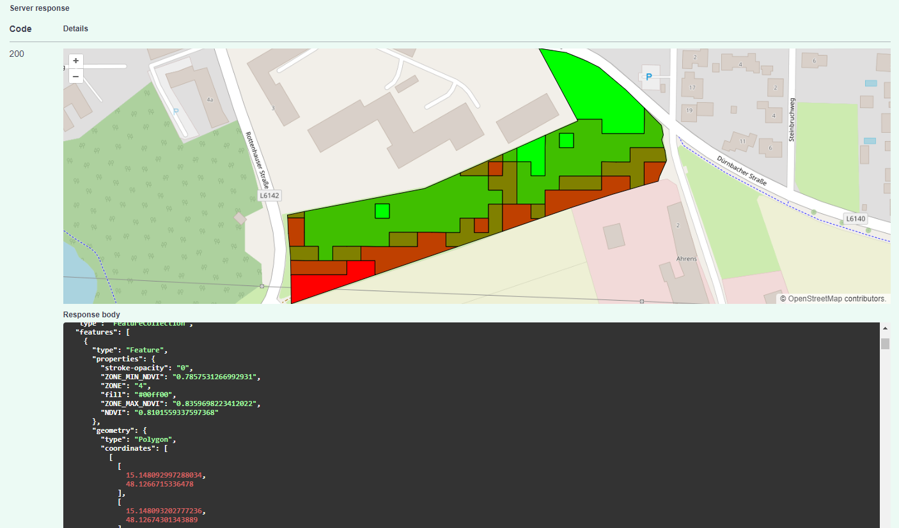

# SwaggerUI Map Plugin
SwaggerUI plugin to show GeoJson responses on a map




## Usage

1. Publish all files from `dist/`
2. Add `Openlayers` and this plugin to your swaggerui index file
```html
<script src="https://cdn.jsdelivr.net/npm/ol@v10.1.0/dist/ol.js" crossorigin></script>
<script src="<published-dist-folder>/swagger-ui-map-plugin.js"></script>
```
3. Register `SwaggerUiMapPlugin()`
```javascript
SwaggerUIBundle({
    ...
    plugins: [
        SwaggerUiMapPlugin()
    ],
    ...
});
```
4. Execute a request whose response is an `application/geo-json`


## Dev

Run `npm install` and then `npm run dev`.

For deployment, build the `dist/swagger-ui-map-plugin.js` with `npm run build`