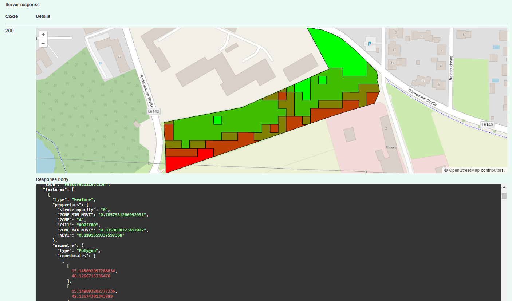

# SwaggerUI Map Plugin

[](https://github.com/Josephinum-Research/swagger-ui-map-plugin/actions/workflows/npm-publish.yml)
[](https://github.com/Josephinum-Research/swagger-ui-map-plugin/releases)
[](https://josephinum-research.github.io/swagger-ui-map-plugin/example.html)

SwaggerUI plugin to show GeoJson responses on a map




## Usage

1. Add `Openlayers` and this plugin to your swaggerui index file
```html
<script src="https://cdn.jsdelivr.net/npm/ol@v10.1.0/dist/ol.js" crossorigin></script>
<script src="https://cdn.jsdelivr.net/npm/@josephinumresearch/swagger-ui-map-plugin/dist/swagger-ui-map-plugin.js" crossorigin></script>
```
2. Register `SwaggerUiMapPlugin()`
```javascript
SwaggerUIBundle({
    ...
    plugins: [
        SwaggerUiMapPlugin()
    ],
    ...
});
```
3. Execute a request whose response is an `application/geo+json`


## Dev

Run `npm install` and `npm run dev`.
